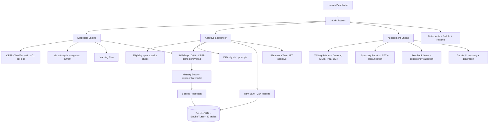

# FluentPath

An adaptive English learning platform covering A1–C2 proficiency plus exam preparation (IELTS, PTE, OET). The system diagnoses each learner's CEFR skill profile, generates personalized lesson sequences, and tracks mastery decay across all language skills — reading, writing, listening, speaking, vocabulary, and grammar.

Built as a production-grade Next.js application: **82,000+ lines of TypeScript**, 42 database tables, 1,100+ automated tests, AI-powered assessment with rubric-based scoring, spaced repetition, and gamification.

---

## Architecture



## Problem Statement

English language learning platforms face a fundamental trade-off: generic content is scalable but ineffective, while personalized instruction is effective but doesn't scale. Most platforms offer a fixed curriculum where every learner follows the same path regardless of their starting level, existing strengths, or target exam.

Three technical challenges make adaptive language learning harder than general adaptive education:

1. **Multi-dimensional proficiency** — Language competence isn't a single score. A learner might be B2 in reading but A2 in speaking. Diagnosis must map each skill independently across the 6 CEFR levels (A1–C2), producing a multi-dimensional profile rather than a single placement.
2. **Skill decay** — Unlike math or programming, language skills degrade without practice. A learner who reached B1 listening three months ago may have decayed to A2. The system must model decay and schedule reviews at the right intervals.
3. **Exam-specific scoring** — IELTS, PTE, and OET each use different scoring rubrics for writing and speaking. An AI scoring system must implement each rubric faithfully, not approximate with a generic "good/bad" signal.

---

## Technical Deep Dive

### CEFR Diagnostic Engine

The diagnostic module classifies learner proficiency across multiple language domains using a multi-attribute analysis pipeline:

**Stage 1 — Attribute Extraction:** Raw learner responses are decomposed into measurable attributes: vocabulary range, grammatical accuracy, cohesion, task achievement, pronunciation features (for speaking), and argument development.

**Stage 2 — CEFR Classification:** Each attribute is mapped to a CEFR level (A1–C2) using band descriptors derived from the official CEFR framework. The classifier handles the common case where a learner performs at different levels on different attributes — a B1 vocabulary range with A2 grammatical accuracy produces a split-level profile, not a blended score.

**Stage 3 — Gap Analysis:** The diagnosed profile is compared against the learner's target (general improvement, IELTS band 7, PTE 79+, OET B grade). The gap analysis identifies which skills need the most work and in what order, considering prerequisite dependencies in the skill graph.

**Stage 4 — Learning Plan:** The gap analysis feeds into a structured plan: which skills to prioritize, what lesson types to use, and how many practice sessions are needed to reach the target. The plan updates dynamically as the learner progresses.

### Skill Graph

Language competencies form a directed acyclic graph where each node is a CEFR-aligned skill and edges represent prerequisites:

- **Level validation** — A learner cannot attempt C1 writing tasks without demonstrating B2 cohesion and B2 argument structure
- **Cross-skill dependencies** — Speaking assessment at B2+ requires B2 vocabulary, because a learner cannot demonstrate fluency without sufficient lexical range
- **Progression rules** — Mastery at one level unlocks the next level's skills in the same domain, but only when prerequisites from other domains are also satisfied

### Mastery and Spaced Repetition

The mastery module models each learner's skill state as a combination of demonstrated level and decay:

**Mastery State:** Each skill carries a mastery score, a timestamp, and a decay constant. The decay constant is calibrated per skill — vocabulary decays faster than grammar rules, and productive skills (writing, speaking) decay faster than receptive skills (reading, listening).

**Decay Model:** Mastery decays exponentially from the last practice timestamp. A skill mastered to 0.9 three weeks ago with a decay constant of 0.05/day is now at approximately 0.32 — below the threshold for "retained" and scheduled for review.

**Update Rules:** When a learner practices a skill and demonstrates mastery, the mastery score increases and the decay constant decreases (the skill becomes more durable). Repeated successful reviews make a skill increasingly resistant to decay.

### Adaptive Sequencer

The sequencer assembles personalized lesson sessions by selecting from the item bank based on multiple constraints:

1. **Eligibility** — Only lessons whose prerequisite skills are mastered (per the skill graph) are candidates
2. **Gap priority** — Lessons targeting the learner's weakest skills are weighted higher
3. **Decay urgency** — Skills approaching the decay threshold are prioritized for review
4. **Difficulty calibration** — Lesson difficulty matched to current level with slight upward pressure (i+1 principle)
5. **Variety** — Avoids repeating the same skill type in consecutive lessons

### Writing Assessment

The writing module implements 4 independent rubric systems:

| Rubric | Criteria | Scale |
|--------|----------|-------|
| **General** | Task achievement, coherence, vocabulary, grammar | 1–10 |
| **IELTS** | Task response, coherence/cohesion, lexical resource, grammatical range | Band 0–9 |
| **PTE** | Content, form, grammar, vocabulary, spelling | 10–90 |
| **OET** | Purpose, content, tone, layout, grammar, vocabulary | A–E |

Each rubric is a separate module with its own scoring logic. The AI assessment pipeline works in two stages:

**Pass 1 — Scoring:** The learner's writing is evaluated against the selected rubric's criteria. The prompt includes the specific band descriptors so the AI applies the exam's actual standards.

**Pass 2 — Feedback Gates:** Before feedback is returned, validation gates check: (a) scores are internally consistent, (b) feedback references specific passages from the learner's writing, and (c) improvement suggestions are actionable and level-appropriate.

### Speaking Assessment

Speaking assessment combines speech-to-text transcription with rubric-based scoring. The system abstracts the STT provider behind an interface, allowing different engines to be swapped without changing assessment logic. Beyond transcription, the system extracts pronunciation features — hesitation patterns, intonation contours, and phoneme accuracy — which feed into exam-specific speaking rubrics.

### Adaptive Placement Test

For learners who skip the full diagnostic, the placement test uses an adaptive algorithm inspired by Item Response Theory (IRT):

1. Start at B1 (mid-range) difficulty
2. Correct answer → increase difficulty; incorrect → decrease
3. Continue until the confidence interval narrows below a threshold
4. Map estimated ability to a CEFR level per skill tested

This typically requires 15–20 items to place a learner accurately, versus 40+ in a fixed diagnostic.

---

## AI/ML Techniques

| # | Technique | Implementation | Purpose |
|---|-----------|---------------|---------|
| 1 | **CEFR Diagnostic Engine** | Multi-attribute classification (A1–C2) | Precise skill-level diagnosis per language domain |
| 2 | **Adaptive Placement** | Item Response Theory-based adaptive testing | Place learners at correct level without full diagnostic |
| 3 | **AI Writing Assessment** | Rubric-based scoring (IELTS/PTE/OET rubrics) | Score writing tasks with exam-aligned feedback |
| 4 | **AI Speaking Assessment** | Speech-to-text + rubric scoring | Evaluate pronunciation, fluency, grammar in speech |
| 5 | **Mastery Decay Model** | Spaced repetition with exponential decay | Schedule reviews at optimal intervals |
| 6 | **Adaptive Sequencer** | Eligibility + difficulty + gap analysis | Generate personalized lesson sequences per learner |
| 7 | **Content Generation** | AI-powered lesson and exercise creation | Scale content across 6 CEFR levels and 3 exam types |
| 8 | **Skill Graph Engine** | Dependency-aware CEFR competency map | Track and validate prerequisite mastery chains |

## Exam Preparation

| Exam | Support Level | Features |
|------|--------------|---------|
| **IELTS** | Full | Task 1 + Task 2 writing rubrics, speaking rubrics, mock tests |
| **PTE** | Full | Writing rubrics, speaking rubrics, scored practice |
| **OET** | Full | Healthcare-specific writing rubrics, speaking scenarios |
| **General English** | Full | A1–C2 curriculum, all 6 language skills |

## Tech Stack

| Layer | Technology |
|-------|-----------|
| Framework | Next.js (App Router) |
| Language | TypeScript |
| Database | SQLite via Drizzle ORM (42 tables, 7 migrations) |
| Auth | Better Auth (email + social) |
| AI | Google Gemini (assessment, generation) |
| Speech | STT provider abstraction (speaking assessment) |
| TTS | Text-to-speech for listening exercises |
| Billing | Paddle |
| Email | Resend |
| Analytics | PostHog |
| Testing | Vitest (1,100+ tests) |
| Deployment | Vercel + Turso |

## Project Structure

```
fluentpath/                         # 82,000+ lines of TypeScript
├── src/
│   ├── app/
│   │   ├── api/                    # 39 API routes
│   │   │   ├── diagnosis/          # CEFR diagnostic endpoints
│   │   │   ├── placement/          # Adaptive placement test
│   │   │   ├── lessons/            # Lesson CRUD + sequencing
│   │   │   ├── writing/            # Writing submission + scoring
│   │   │   ├── speaking/           # Speaking assessment + STT
│   │   │   ├── mock-test/          # Full exam simulations
│   │   │   ├── practice/           # Skill practice sessions
│   │   │   ├── progress/           # Learner progress queries
│   │   │   ├── gamification/       # XP + streaks + achievements
│   │   │   └── admin/              # Admin content management
│   │   └── page.tsx                # Learner dashboard
│   ├── components/                 # 41 React components
│   ├── diagnosis/                  # CEFR diagnostic engine
│   ├── skill-graph/                # Competency dependency map
│   ├── mastery/                    # Spaced repetition + decay
│   ├── sequencer/                  # Adaptive lesson sequencer
│   ├── writing/                    # Writing assessment (13 files)
│   ├── speaking/                   # Speaking assessment (8 files)
│   ├── placement/                  # Adaptive placement test
│   ├── content/                    # Item bank + ingestion
│   ├── generation/                 # AI content generation
│   ├── profiler/                   # Learner profiling + vocab
│   ├── gamification/               # XP + streaks
│   ├── mock-test/                  # Exam simulation engine
│   ├── db/
│   │   ├── schema/                 # 42 tables across modules
│   │   ├── repositories/           # Data access layer
│   │   └── client.ts               # Drizzle + Turso connection
│   └── lib/                        # Auth, email, billing, utils
├── tests/                          # 109 test files, 1,100+ tests
├── data/inventories/               # Vocabulary inventory data
├── drizzle/                        # 7 versioned migrations
└── scripts/                        # Seeding + admin tooling
```

## By the Numbers

| Metric | Value |
|--------|-------|
| Lines of code | 82,000+ TypeScript |
| Source files | 483 modules |
| API routes | 39 endpoints |
| React components | 41 |
| Database tables | 42 |
| Migrations | 7 versioned |
| Test files | 109 |
| Passing tests | 1,100+ |
| Writing rubrics | 4 systems (general, IELTS, PTE, OET) |
| Content lessons | 264 (writing + speaking) |
| CEFR levels | 6 (A1–C2) |

## Key Engineering Decisions

**Why CEFR as the core model?** The Common European Framework of Reference is the international standard for language proficiency. Building the entire system around CEFR levels (A1–C2) ensures every diagnostic, lesson, and assessment maps to a globally recognized scale — critical for exam prep (IELTS, PTE, OET all reference CEFR).

**Why a skill graph with dependencies?** Language skills have prerequisites — you can't write complex arguments (C1) without mastering cohesion (B2). The skill graph enforces these dependencies, preventing the sequencer from assigning lessons above the learner's readiness level.

**Why mastery decay?** Language skills degrade without practice. The exponential decay model schedules reviews at optimal intervals (spaced repetition), so learners maintain skills they've already acquired while progressing to new ones.

**Why separate rubrics per exam?** IELTS, PTE, and OET score writing and speaking differently. IELTS uses band descriptors (0-9), PTE uses communicative skills scoring, OET uses healthcare-specific criteria. Each rubric system is implemented separately to give learners exam-accurate feedback.

**Why 1,100+ tests?** An adaptive learning platform where incorrect scoring damages learner outcomes. Every rubric, scoring algorithm, diagnostic classifier, and sequencing rule is tested to prevent regressions that could misdiagnose a learner's level or score an exam task incorrectly.

## Future Work

- **Reading and listening content** — Expand the item bank to cover all 6 language skills with full CEFR coverage
- **Real-time speaking practice** — Live conversation mode with AI interlocutor for fluency development
- **Cohort analytics** — Dashboard for language schools and bootcamps tracking class-wide progress
- **Predictive scoring** — Use historical mastery data to predict exam scores before the learner sits the test

## Setup

```bash
git clone https://github.com/Leo-emp/Fluentpath.git
cd Fluentpath

npm install

cp .env.example .env
# Add: DATABASE_URL, GEMINI_API_KEY, BETTER_AUTH_SECRET
# Add: PADDLE_API_KEY, RESEND_API_KEY, POSTHOG_KEY

npx drizzle-kit migrate
npm run dev
```

## Live

- **Repository:** [github.com/Leo-emp/Fluentpath](https://github.com/Leo-emp/Fluentpath)

## License

MIT
